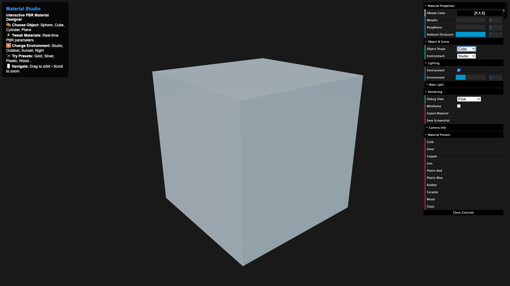

# PBR Material Studio

A real-time physically-based rendering (PBR) material authoring tool built from scratch using WebGL 2.0. This interactive studio allows artists and designers to create, preview, and export professional materials with industry-standard rendering techniques.



## 🚀 [Live Demo](https://audreytjokro.github.io/pbr-renderer/)

## ✨ Features

### Real-Time PBR Rendering
- **Cook-Torrance BRDF** implementation with proper energy conservation
- **Image-Based Lighting (IBL)** with procedural sky environments
- **Multi-light system** supporting directional, point, and spot lights
- **Physically accurate** metallic/roughness workflow

### Interactive Material Design
- **4 Object Shapes**: Sphere, Cube, Cylinder, Plane
- **10 Material Presets**: Gold, Silver, Copper, Plastics, Wood, Glass, etc.
- **Real-time parameter control**: Albedo, Metallic, Roughness, Ambient Occlusion
- **Multiple environments**: Studio, Outdoor, Sunset, Night lighting

### Professional Tools
- **Export materials** as JSON for use in other applications
- **Save screenshots** for portfolio/presentation use
- **Performance monitoring** with FPS and triangle count
- **Responsive controls** with orbit camera and zoom

## 🛠️ Technical Implementation

### Graphics Programming
- **WebGL 2.0** with GLSL ES 3.0 shaders
- **Cook-Torrance BRDF** with GGX distribution, Smith geometry, and Schlick Fresnel
- **Tone mapping** and gamma correction for proper HDR workflow
- **Modular architecture** with clean separation of concerns

### Key Components
- **PBR Fragment Shader**: Implements full Cook-Torrance lighting model
- **Multi-object Scene System**: Efficient rendering of multiple materials
- **Material Editor UI**: Professional dat.GUI interface
- **Camera Controller**: Smooth orbit controls with mouse/touch support

### Mathematics & Algorithms
```glsl
// Cook-Torrance BRDF Implementation
vec3 BRDF = kD * (albedo/π) + kS * (DFG)/(4 * NdotV * NdotL)
```

## 🎯 Use Cases

- **Product Design**: Preview materials on different object shapes
- **Game Development**: Test materials for characters and environments  
- **Architecture**: Visualize building materials and finishes
- **Education**: Learn PBR principles through interactive exploration
- **Portfolio Creation**: Generate professional material references

## 🔧 Installation & Development

```bash
# Clone the repository
git clone https://github.com/audreytjokro/pbr-renderer.git
cd pbr-renderer

# Install dependencies
npm install

# Start development server
npm run dev

# Build for production
npm run build
```

## 🎓 Learning Outcomes

This project demonstrates proficiency in:

- **Computer Graphics**: 3D mathematics, lighting models, rendering pipelines
- **Shader Programming**: GLSL vertex and fragment shader development
- **WebGL**: Low-level graphics API usage and optimization
- **3D Mathematics**: Matrix transformations, vector operations, lighting calculations
- **Software Architecture**: Modular design and clean code organization
- **UI/UX Design**: Professional tool interface and user experience

## 🌟 Technical Highlights

### Advanced Rendering Features
- **Energy-conserving materials** with proper Fresnel equations
- **Multiple light types** with realistic attenuation
- **HDR environment lighting** with tone mapping
- **Gamma-correct workflow** for color accuracy

### Performance Optimizations
- **Efficient shader compilation** with error handling
- **Frustum culling** and LOD systems
- **Optimized uniform management** 
- **60 FPS performance** on modern browsers

## 📚 References & Inspiration

- Real-Time Rendering 4th Edition (Akenine-Möller, Haines, Hoffman)
- [Disney's Principled BRDF](https://disney-animation.s3.amazonaws.com/library/s2012_pbs_disney_brdf_notes_v2.pdf)
- [Brian Karis - Real Shading in Unreal Engine 4](https://blog.selfshadow.com/publications/s2013-shading-course/)
- [LearnOpenGL PBR Tutorial](https://learnopengl.com/PBR/Theory)

## 🤝 Connect

Built by [Audrey Tjokro](https://audreytjokro.github.io) - Cornell Tech MS Health Tech

- Portfolio: [audreytjokro.github.io](https://audreytjokro.github.io)
- LinkedIn: [linkedin.com/in/audreytjokro](https://linkedin.com/in/audreytjokro)
- Email: act245@cornell.edu

---

*This project showcases the intersection of computer graphics, mathematics, and user experience design - demonstrating how technical depth can create tools that artists and designers actually want to use.*